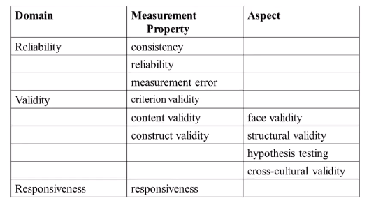
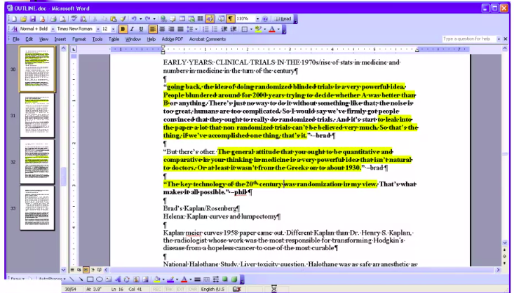

## Unit 4 - The Writing Process

### Table of contents
* [1. More paragraph practice](#1-More-paragraph-practice) 
* [2. Overview of the writing process](#2-Overview-of-the-writing-process)
* [3. The pre-writing step](#3-The-pre-writing-step)
* [4. The first draft writing step](#4-The-first-draft-writing-step)
* [5. Revision](#5-Revision)
* [6. Checklist for the final draft](#6-Checklist-for-the-final-draft)
* [Notes](#Notes)

### 1. More paragraph practice
+ **Practice 1:**
	+ ***Original paragraph***: 
		> "In assessing the quality of an instrument we distinguish three quality domains, i.e. reliability, validity, and responsiveness. Each domain contains one or more measurement properties. The domain reliability contains three measurement properties: internal consistency, reliability, and measurement error. The domain validity also contains three measurement properties: content validity, construct validity, and criterion validity. The domain responsiveness contains only one measurement property, which is also called responsiveness. The term and definition of the domain and measurement property responsiveness are actually the same, but they are distinguished in the taxonomy for reasons of clarity. Some measurement properties contain one or more aspects, that were defined separately: Content validity includes face validity, and construct validity include structural validity, hypotheses testing, and cross-cultural validity."
	+ ***Original outline***:
		+ The information actually is better presented as a table or tree diagram:
		
	+ ***Edit paragraph***:
		> We assess each instrument based on reliability, validity, and responsiveness. These domains may be subdivided into measurement properties: Reliability includes internal consistency, reliability, and measurement error; validity includes content validity, construct validity, and criterion validity; responsiveness is both a domain and a measurement property. Some measurement properties additionally contain multiple aspects; for example, construct validity includes structural validity, hypotheses testing, and cross-cultural validity.
+ **Practice 2:**
	+ ***Original paragraphs***:
		> "The church’s record-keeping system and its high level of accuracy have been previously reported (2). Briefly, the church creates and maintains a church record for each individual who is baptized into the church. These records are created at the congregation level at the time of baptism and then forwarded to the general church level where the membership record is added to the church membership database. These records contain minimal information including name, date of birth, parents’ names, dates of church ordinances, and current address. Each congregation has a lay membership clerk who is responsible for updating the membership records for the members of the congregation. Such updates would include dates of ordinances received after baptism (e.g., priesthood ordination or marriage), name of spouse when a member marries, change of current address and date of death.  
		> 
		> While the accuracy of the church record is dependent upon lay clerks within each congregation, each member has an opportunity to review their membership record once a year to check it for accuracy. For this reason and because the church emphasizes accurate record keeping, the information available from the church records is quite reliable, especially for members who are actively involved in the church. When a member dies and the clerk reports his/her death to the Church Membership Council, the membership record is updated and then archived in the church’s deceased membership file."
	+ ***Original outline***:
		+ Main idea: The church's record-keeping system is accurate and reliable.
		+ Point 1: The church congregation create new member record when he/she is baptized.
		+ Point 2: There is a lay clerk who updates these records.
		+ Point 3: Member has an opportunity to review their membership once a year.
		+ Point 4: When a member dies, the membership record is archived.
	+ ***Edit paragraph***:
		> The church's record-keeping system is accurate and reliable (2). When a new member is baptized, the church congregation creates a member record that includes: name, date of birth, parents' names, current address, and dates of church ordinances. A lay clerk enters these records into a general church database and updates them to reflect dates of new ordinances (e.g. marriage), spouse name, changes of address, and date of death. Members may review their membership records once a year, which helps ensure accuracy. When a member dies, their membership record is archived.
+ **Practice 3:**
	+ ***Original paragraph***:
		> "Previous studies have consistently reported increased risk of subsequent drug use associated with conduct problems and antisocial behavior in childhood (1-5), and an association of drug dependence with conduct problems was found in a general survey of young adults (9). Furthermore, long-term relationships between aggressive, unconventional, and impulsive behaviors have also been found with drug use involvement generally (10-12). However, different pathways between early childhood misbehavior and drug involvement may exist. Psychiatric symptoms and cognitive disabilities may be manifest as aggressive behaviors and drug use may be a response to impulsive tendencies that often co-occur with aggression or misbehavior. Distress and failure to adopt responsible conventional roles and behaviors may be important mediators linking childhood misbehavior to late drug dependence (13,14)."  
	+ ***Original outline***:
		+ Idea 1: Previous studies have linked early childhood conduct problems with subsequent drug use.
		+ Idea 2: There might be other pathways to explain this link.
	+ ***Edit paragraph 1***: Separate ideas into two paragraphs
		> Previous studies have linked early childhood conduct problems with subsequent drug use (1-5). Studies have also found that young adult (9) and adult (10-12) drug users exhibit more aggressive, unconventional, and impulsive behaviors than their peers.  
		> Several pathways may explain our finding: aggressive children may have underlying psychiatric disorders or cognitive disabilities that increase their risk of drug use; misbehavior tends to co-occur with impulsivity, which increases the risk of drug use; and childhood misbehavior may lead to long-term problems, such as persistent distress or a failure to ever adopt conventional roles or behaviors, which may lead to drug dependence(13,14).
	+ ***Edit paragraph 2***: Remove unrelated material (Adult)
		> Previous studies have linked early childhood conduct problems—including aggressive, unconventional, and impulsive—with subsequent drug use (1-5). Several pathways may explain this link: aggressive children may have underlying psychiatric disorders or cognitive disabilities that increase their risk of drug use; misbehavior tends to co-occur with impulsivity, which increases the risk of drug use; and childhood misbehavior may lead to long-term problems, such as persistent distress or a failure to ever adopt conventional roles or behaviors, which may lead to drug dependence(13,14).

### 2. Overview of the writing process
+ One of the major problems scientists have when writing is that they convoluted these 3 steps => makes writing harder, less efficient, and reduces the quality of the final product.
+ Three steps in the writing process:
	1. **Pre-writing** (The essential one)
		+ Collect, synthesize, and organize information 
		+ Brainstorm take-home messages
		+ Work out ideas away from the computer
		+ Develop a road map/outline
	2. **Writing the first draft** (The hardest one)
		+ Putting your facts and ideas together in organized prose
		+ Writing quickly and efficiently. Just write the ideas down and then go back and revise later.
	3. **Revision** (The important one)
		+ Read your work out loud
		+ Ged rid of clutter
		+ Do a verb check
		+ Get feedback from others
+ Time should spend (roughly!): 
	+ Pre-writing: ***70%***
		+ The majority of your time should be spent in the pre-writing stage
	+ Writing the first draft: ***10%***
		+ Writing prose takes the most focus and energy
		+ So it's more efficient and less painful if spend less time in that step
	+ Revision: ***20%***
		+ Revision is where elegance happens in writing
		+ We should spend more time revising than writing the first draft

### 3. The pre-writing step
+ Tips for the pre-writing
	+ **Get organized first!**
	+ Don't try to write and gather information simultaneously!
	+ Gather and organize information ***BEFORE*** writing the first draft
+ Organizing system:
	+ Create one that suits you!
	+ Spend more time organizing and less time writing. It's just plain less painful!
+ Develop a road-map:
	+ Arrange key facts and citations from the literature into a crude road map/outline BEFORE writing
	+ Think in paragraphs and sections...
	+ Example of a road map:  
	
		+ Just throw things into the Word document as they come along
		+ Highlight favorite information, which could make it into the final article
		+ Information comes with details about the day, name, details, examples...  
		=> Make writing efficient
+ Brainstorm while away from the computer
	+ A lot of pre-writing can be done away from the computer while you're multitasking
	+ Brainstorm when the brain is free
		+ Utilize the exercising, driving, or waiting time when the brain just wanders 
			+ Think about how a piece is gonna be structured
			+ Think about what the main take-home messages are
		+ Sometimes it comes up with new ideas or new connections
	+ Work out take-home messages
	+ Organize your paper
	+ Write memorable lines  
+ Organization:
	+ Like ideas should be grouped
	+ Like paragraphs should be grouped
	+ Don't "Bait-and-switch" (pros and cons) the reader too many times
		+ Better way to organize discussion:
			+ Put all the **pro arguments** first
			+ Then present all the **counter-arguments**
			+ Finally, present all the **rebuttals**
### 4. The first draft writing step 
+ The hardest step for most people
+ Tips for writing the first draft
	+ Don't be a perfectionist!
	+ The goal is to **get the ideas down** in complete sentences in order.
	+ Focus on **logical organization** more than sentence-level details.
	+ Minimize the pain by writing the first draft **quickly** and **efficiently**.
+ **Example 1**:
	+ **_First draft_**:
		> Errors in publication occur when the authors have typos, omissions, or such poor writing of the methods that others can't figure out what they did or reproduce their tables and figures. Sometimes there's just so much to write up that errors will occur in almost every case.  
	
		=> boring verbs, unnecessary `there is`   
		=> but have all the details and completed sentences.  
	+ **_Revised version_**:  
		> Published papers frequently have typos, omissions, and otherwise poor documentation of methods. These errors make it impossible to figure out exactly what was done or to reproduce the results.  
	
		=> More clear, concise, to the point
+ ***Example 2***:
	+ **_First draft_**:
		> The finding of these HLA alleles may have some practical implications as well. Now we all divide up into those who carry archaic DNA and those who don't. A potential implication is that people who carry archaic HLAs could be more prone to autoimmunity. Autoimmunity is associated with HLA factors. There could be downsides to archaic HLAs. Since we've evolved separately from Neanterdals for a few hundred thousand years, we may have evolved important differences in the proteins that interact with HLA. The archaic HLAs may interact more poorly with some of these proteins, potentially causing mistakes, like autoimmunity. "This is all just speculation. But we have been apart for all this time, so it would be very surprising if there weren't differences," Parham says. "It would solve a long-standing puzzle."  
	
		=> boring verbs, boring sentence structure, messy  
		=> but have all the idea
	+ **_Revised version_**:
		> Neanderthal (or Denisovan) proteins continue to live on and function inside us; and this may also have a downside, Parham notes. Neanderthals elegance separately from us for a few hundred thousand years, so their proteins may be somewhat mismatched to our immune systems and could play a role in autoimmune disease. Autoimmunity is poorly understood by known to be related to HLA types. "This is all just speculation. But we have been apart for all this time, so it would be very surprising if there weren't differences," Parham says. "It would solve a long-standing puzzle."  
	
		=> Same ideas with the original  
		=> More succinct and clear and elegant
+ ***Example 3***:
	+ **_First draft_**:
		> It's also difficult to study the biology because the brain is so inaccessible. Cancer scientists can take out a tumor and look directly at the cells, but autism researchers cannot directly study brain cells (except on autopsy), let alone developing brain cells. Stanford is on the cutting edge of solving this problem — in fact, Dolmetsch's solution is so innovative it seems straight out of a science fiction novel.  
	
		=> boring verbs, wordy, start with `it is`
	+ **_Revised version_**
		> It's also difficult to access the brain. Scientists can slice cancer cells out of a tumor and directly study them, but they can't just scoop cells out of the brain, let alone the developing brain. Standford is on the cutting edge of solving this problem — in fact, Dolmetsch's solution seems straight out of a science fiction novel.  
	
		=> nice verbs (`slice`, `scoop`)  
		=> cut extra words to make it more succinct  
	+ **_Final version (after outside editing!)_**:
		> Another impediment: access to the brain. Scientists can slice cancer cells out of a tumor and study them directly, but they can't just scoop cells out of the brain. Stanford is on the forefront of solving this problem—in fact, Dolmetsch's solution seems straight out of a science fiction novel.  
	
		=> Use colon: emphasis  
		=> More clear and elegant
### 5. Revision
+ This is where the elegance comes in writing
+ Tips for the revision:
	+ **Read the work out loud**
		+ The brain processes the spoken word differently than the written word!
		+ Help pick up where things don't sound good  
		=> Identify the awkwardness, the repetition or the wordiness
	+ **Do the verb check**
		+ Underline the main verb in each sentence
		+ Think carefully about the verb choices
		+ Watch for:  
			(1) Lackluster verbs (_"to be"_ verbs)  
			(2) Passive verbs  
			(3) Burried verbs  
		+ Just chaning a few verb to make them more spunky  
		***=> making the writing more lively and accessible***
	+ **Cut clutter**
		+ Watch for:
			+ Dead weight words and phrases (e.g., it should be emphasized that, my opinion)
			+ Empty words and phrases (e.g., basic tenets of, important)
			+ Long words or phrases that could be short (e.g., muscular and cardiorespiratory performance => fitness)
			+ Unnecessary jargon and acronyms
			+ Repetitive words or phrases (e.g., teaches/guides)
			+ Adverbs (e.g., `very`, `really`, `quite`, `basically`)
	+ **Do an organizational review**
		+ In the margins, tag each paragraph with a phrase or sentence that ***sums up the main point***
		+ Then move paragraphs around to improve the ***logical flow*** and bring similar ideas together
		+ Even combine those paragraphs to reduce repetition  
		***=> Helps assess the logical flow***
	+ **Get feedback from others**
		+ Ask someoone outside to read the manuscript
			+ They don't have to be a people in the field
			+ Just sombody who intelligent enough to be able to read scientific manuscript
		+ With out any technical background, they can and should easily graps (without any problem):
			+ The main findings
			+ Take-home messages
			+ Significant of your work
		+ If they are struggling, ask them to point out particularly hard-to-read sentences and paragraphs  
		=> These are places where you can ***focus your revision efforts***  
		=> Make the writing more clear, succinct and engaging
	+ **Get editing help**
		+ Find a good editor to edit writing
		+ They should know how to do some sentence-level editing
### 6. Checklist for the final draft
+ **Check for consistency**
	+ Make sure that the manuscript doesn't have things that are ***contradictory*** in different places/sections
	+ Example:
		+ Methods section: "We followed participants for a minimum of 2 years."
		+ Results section: "The average follow-up time was 1.5 years."
+ **Check for numerical consistency**
	+ Does the numbers in abstract ***match*** the numbers in tables/figures/text?
	+ Does the numbers in the text ***match*** those in the tables/figures?
	+ Does the numbers in each table/figure ***match*** those in other tables/figures?
+ **Check your references**
	+ Make sure to don't have any ***"reference to nowhere"***
		+ Reference ***does not contain*** the promised information that the authors indicated
	+ Refenece does not provide the indicated information/fact
		+ Authors ***misinterpreted or exxagerated*** the findings form the original source
		+ Reference ***cites a secondary source*** rather than a primary source  
			=> lose important pieces of information, things often get completely garbled
		+ Author misnumbered the references, or put the right reference in the wrong place 
	+ ***Always double-check the references***
***
### Notes
+ It is okay for the first draft to violate many rules for good writing
	+ You can fix all of that later as long as **the ideas are clearly laid out** and you know **what you want to go** in each paragraph
	+ The sentence-level editing happens in **the revision** step
+ Use [**Thesaurus**](http://www.thesaurus.com/) to find a good verb
+ Always cite/go back to the ***primary sources***!
+ Assume that other authors have made errors in citing sources!
+ One more tip on making writing easier:
	+ Break the writing task into small, reasonable, and realistic goals:
		+ **_Example:_**
			+ My goal is to write 400 words today.
			+ My goal is to write the first two paragraphs of the discussion section today.

***

  
  
_This note was created by [**quanghuy0497**](https://github.com/quanghuy0497/Writing-in-the-Science_Stanford)@2021_

