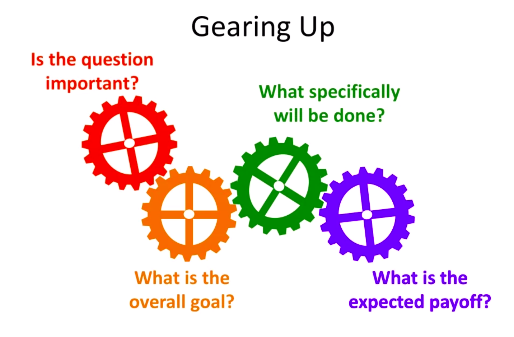
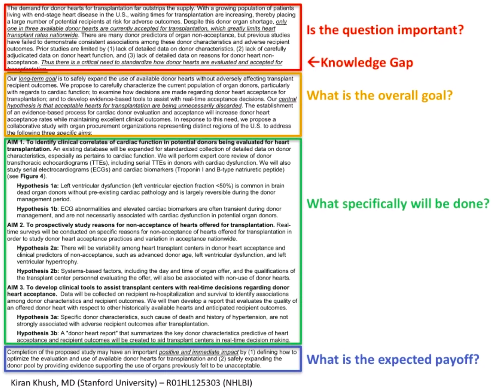
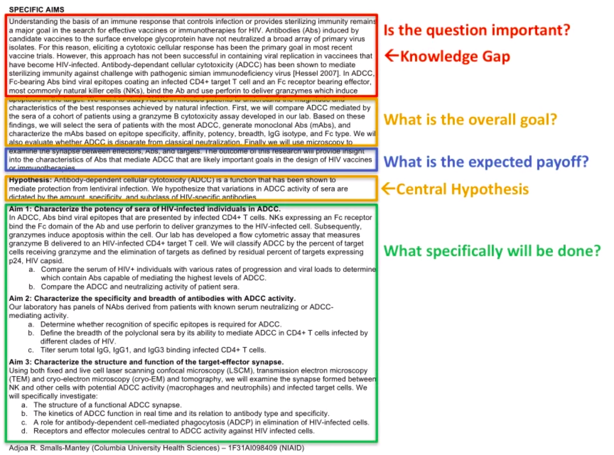

## Unit 7- Beyond the Research Manuscript

### Table of contents
* [1. Writing a Review Article](#1-Writing-a-Review-Article)
* [2. Writing for Grants part I - Tips for Writing Proposals](#2-Writing-for-Grants-part-I---Tips-for-Writing-Proposals)
* [3. Writing for Grants part II - The Specific Aims](#3-Writing-for-Grants-part-II---The-Specific-Aims)
* [4. Writing for Grants part III - The Research Plan](#4-Writing-for-Grants-part-III---The-Research-Plan)
* [5. Writing Letters of Recommendation](#5-Writing-Letters-of-Recommendation)
* [6. Writing Personal Statements](#6-Writing-Personal-Statements)

### 1. Writing a Review Article
+ **Goals of writing a Review Article**
	+ Synthesize and evaluate the recent primary literature on the topic
	+ Summarize the current state of knowledge on a topic
	+ Address controversies
	+ Provide a comprehensive list of citations
+ **Types of a Review Article**
	+ Non-systematic
		+ Sometimes called a "narrative" review
		+ May not be comprehensive
		+ Qualitative review
	+ Systematic
		+ Attempts to find and summarize _all_ relevant studies on a particular research question. May even include unpublished work.
		+ Follows a rigorous search strategy using pre-defined exclusion and inclusion criteria. Searches multiple databases.
		+ Evaluates the quality of each study using rigorous, pre-defined criteria (often quantitative).
	+ Meta-analysis
		+ A systematic review that additionally uses statistical techniques to pool data from independent studies (sometimes including unpublished studies)
+ **Tips for Review Articles**
	+ Start by searching the literature
		+ Begin with a broader search, to get a sense of what's out there
		+ Then narrow your focus
	+ **_Clearly define your thesis or theme_**
		+ This is the key to a good review article
		+ It can't just be a too broad topic (e.g. I'm going to review computer vision, or breast cancer)
		+ The topic has to be narrow and focused enough to make it tractable (e.g research on the few-shot object detection; the link between smoking and cancer;...)
	+ Invest time getting organized!
		+ Focus on the pre-writing step
		+ You have to find a way to get organized or you will never finish writing the review, there's just too much information
		+ A tip to organize:
			+ Type notes from each paper as you read these papers.
			+ Figured out the sections and subsections of the paper early in the process.
			+ Then, you can organize the notes by section and subsection.
	+ Divide the review into sections with separate headings
	+ Consider putting information in tables, figures, and/or sidebars
	+ Write for a broad audience
		+ People may read your review article as an introduction to the field
		+ Don't abbreviate too much, don't assume prior knowledge
		+ Write in a lively, engaging, and easy to read style
+ **Structure**
	+ Abstract
		+ Write last
	+ Introduction
		+ Clearly state the aim of the review
	+ The body of the paper
		+ Divide into sections
		+ Summarize the literature, organized based on methodology or theme
			+ What we know? What remains unknown?
			+ How studies could do better in the future to fill in the gaps
		+ Analyze, interpret, critique, and synthesize studies	 
	+ Conclusion and future directions:
		+ What recommendations can you make?
		+ What gaps remain in the literature? What future studies would help fill in these gaps?
	+ References
+ **Examples:**
	+ **_Theme and thesis 1:_**
		> _"Eating disorders in athletes have distinct etiologies and require specialized approaches to measurement, diagnosis, prevention and treatment...This chapter will critically review the latest research on ED in athletes, including: (1) issues in measurement, (2) sport and gender-specific prevalences, (3) risk and protective factors, (4) short and long-term sequelae, (5) prevention strategies, and (6) treatment strategies."_   
	+ **_Logical structure 1:_**
		+ _Abstract_
		+ _Introduction_
		+ _Definitions and diagnostic criteria_
		+ _Measurement issues in research_
		+ _Prevalence_
		+ _Risk factors_
		+ _Outcomes_
		+ _Screening and prevention_
		+ _Treatment_
		+ _Conclusion_
		+ _References_
	+ **_Theme and thesis 2:_**
		> _"We review the history of CRISPSR (clustered regularly interspaced palindromic repeat) biology from its initial discovery through the elucidation of the CRISPR-Cas9 enzyme mechanism, which has set the stage for remarkable developments using this technology to modify, regulate, or mark genomic loci in a wide variety of cells and organisms from all three domains of life."_   
	+ **_Logical structure 2:_**
		+ _Abstract_
		+ _CRISPR-cas: A revolution in genome engineering_
		+ _Genome engineering—A decades-long goal_
		+ _History and biology of CRISPR-Cas systems_
		+ _Functionality of CRISPR-Cas9_
		+ _Mechanism of CRISPR-Cas0—mediated genome targeting_
		+ _Engineering cells and model organisms_
		+ _Further development of the technologu_
		+ _Conclusion and perspectives_
		+ _References and Notes_
	+ **_Theme and thesis 3:_**
		>	_"A thorough undersanding of the dynamics of Ebola virus prersistence and shedding in the diverse body compartments and fluids is essential to estimating and mutigating risk of transmission form EVD survivors. We review here the present evidence on the subject and discuss the potential risk of transmission from persistent Ebola virus infection."_  
	+ **_Logical structure 3:_**
		+ _Abstract_
		+ _Methods (Search strategy)_
		+ _Shedding_
			+ _The need for Standarization (measurement)_
			+ _Blood_
			+ _Body Fluids_
		+ _Transmission_
			+ _Contact with Body Fuids and Cadavers_
			+ _EVD as a Sexually Trasmitted Disease_
			+ _..._
			+ _Other Risks of Transmission from Survivors_
			+ _Implications on Discharge Policy_
		+ _Conclusion_
		+ _References and Notes_
+ **The Key of writing a Review Article**
	+ Narrowly and clearly defining the theme of your review
	+ Collecting, reading, and organizing papers in an efficient manner
	+ Comming up with a good, logical organizational structure

### 2. Writing for Grants part I - Tips for Writing Proposals
+ **Why submit a research proposal**
	+ Clarifies and deepens your thinking
	+ Increases productivity and impact
	+ Critical in all career paths
	+ Securing funding is an accomplishment and has positive career benefits
+ **Tips to start writing for grants**
	1. **_Start Early and gather Critical Information_**   
		+ Compile a comprehensive list of all possible funding opportunities
			+ Ask colleagues, peers and mentors for ideas
			+ Fellowships and career development awards list from institution
		+ Gather critical information
			+ Instructions
			+ Funded & unfunded examples
		+ **_Instruction example:_** [NIH Individual Fellowship(NRSA)](https://researchtraining.nih.gov/programs/fellowships)
			+ Read the funding announcement
				+ Read the entire document and understand what it telling you
				+ Follow the websites attachment and read other documents
				+ Ensure you have all the information available to you
			+ Identify the review criteria
				+ Applicant: research product capability, candidates potential for independent research in future...
				+ Mentor, Co-Mentor, Collaborators: strong track record of mentorship, mentoring plan...
				+ Research Training Plain: research significant, appropriate, feasible,...
				+ Training Potential
				+ Institutional Environment, Commitment
			+ Understand the review process
			+ Learn about internal policies and processes
				+ Submited internally befor the sponsor's deadline?
				+ Extra paperwork?
	2. **Create a Game Plan and Write Regularly**  
		+ Writing a compelling grant takes time, a lot of time
		+ Divide the grant requirements into smaller tasks
			+ Create the task lists
			+ Detail about timeline
			+ Daily or weekly goals or milestones **_=> avoid procrastination_**
		+ Make sure writing regularly (daily or every other day)
			+ Help establish an effective writing practice
			+ Make writing become a habbit
				+ Help increase productivity and reduce anxiety
			+ Make the writing time non-nogotiable => other obligations or distraction don't impede your progress
	3. **Find your Research Niche**  
		+ Deep awareness of your field — identify critical knowledge gaps
		+ Broad familiarity with the wider scientific community
			+ Keep a lost of question or problems inherent to your field
			+ Update this list after reading peer-reviewed papers, review articles, attending seminars or conferences
			+ Narrow down and focus your list through discussion with colleagues, mentors, and key researchers 
		+ Make sure to relevant and appropriate for the mission of the funding opportunity announcement
	4. **Use your Specific Aims document as your Roadmap**  
		+ Detail in [**section 3**](#3-Writing-for-Grants-part-II---The-Specific-Aims)
	5. **Build a First-rate Team of Mentors**   
		+ Leverage the strengths and expertise of collaborators (Team Science)
			+ Helpful to study a complex problem 
		+ Cross-disciplinary to accelerate scientific innovation and translation
			+ Especially important for fellowships and career development awards
	6. **Develop a complete Research Plan**  
		+ Detail in [**section 4**](#4-Writing-for-Grants-part-III---The-Research-Plan)  
	7. **STOP! Get feedback!**  
		+ Feedback is critical to developing a first-class proposal
		+ Need a wide audience providing feedback, as the reviewers will likely come from diverse background
		+ Be proactive in asking for feedback
			+ Colleagues and mentors
			+ Nonscientists can provide critical advice about the clarity
		+ Inform your reviewers of your specific needs (e.g. broader feedback on overall concepts or feasibility? Advice on grammar or writing style?)
	8. **Tell a consistent and cohesive story**  
		+ Grants have numerous documents or sections
			+ E.g. applicant's background and goals, specific aims, research strategy, respective contribution, sponsor, letters of support,...
		+ You must tell a consistent and cohesive story
	9. **Follow specific requirements and proofread for errors and readability**
		+ Strictly follow specific formats and page requirements
		+ Proofread!
			+ Grammar errors and misspelling
			+ Readability
	10. **Recycle and Resubmit**  
		+ Recycle
			+ Submit to many funding opportunities have similar requirement
			+ Increase the odd for success
			+ Tackinng reviewers' comments from a prior submission
			+ Read the instructions carefully
		+ Resubmit to increase the odd

### 3. Writing for Grants part II - The Specific Aims
+ **Specific Aims**
	+ Executive summary of your entire proposal
		+ Perfect for eliciting feedback!
		+ Critical to developing a first-class proposal
	+ It is a road map!
		+ Should provide the conceptual framework of your proposal
	+ Reviewers will read it!
		+ Empower them all the necessary information to fund your project  
	**_=> One of the most important documents of your proposal_**  
+ **Specific Aims Instructions**
	+ **_Example:_**
		> _"State concisely the **goals** of the proposed research and summarize the **expected outcome(s)**, including the **impact** that the results of the proposed research will exert on the research field(s) involved._
		>
		> _List succinctly the **specific objectives** of the research proposed, e.g., to test a stated hypothesis, create a novel design, solve a specific problem, challenge an existing paradigm or clinical practice, address a critical barrier to progress in the field, or develop new technology._
		>
		> _Specific Aims are limited to **one page**"._  
+ **Key questions that need to answer**
	+ _Is the research question important?_
		+ Can it tackle any particular gaps?
		+ Significant advanced on the field
	+ _What is the overall goal?_
		+ The purpose of the proposal
		+ Fill in the gap delineated by addressing the first question
	+ _What specifically will be done?_
		+ Your working hypothesis
		+ Your approach to objectively test the hypothesis
	+ _What is the expected payoff?_
		+ Expected outcomes
		+ Research impact
	  
	+ These questions must be specifically aligned, just like gears
	+ You really need to take a big picture look to make sure each of your answers are **_perfectly alligned_** with other answers
	+ Use the answers to the 4 key questions to organize the Specific Aims document!
+ **Structure**
	1) Is the question important?  
		+ Grabbing attention in the first sentence
			+ Highlight your proposal will support the mission of the funding agency
		+ Bring reviewers up to speed
			+ Summarizing the relevant current knowledge
		+ Frame the knowledge gap/need
			+ Important, drive your proposal
			+ The gap or needs statement should identify the critical bottleneck that slowing or stopping progress in your field
	2) What is the overall goal?  
		+ Big-pictural goal (connect with the first section)
			+ Long term goal for your research program
			+ Or a goal that related directly to the funding agencies mission
		+ Objective of this proposal
			+ Narrow the focus 
			+ Describe the objective of the proposal research
				+ Must direcctly address the knowledge gap or the needs statement in the first section
				+ Must be obtainable regardless of how the hypotheses tests
		+ Best bet/hypothesis
			+ The hypothesis must be objectively testable and should be your prediction or best bet
			+ The hypothesis is the climax of this section (you can **bold** or _italicize_ it)
		+ Supportive preliminary data
			+ Describe the data that help you formulate your hypothesis
	3) What specifically will be done?  
		+ Aims
		+ Working hypotheses
		+ Methods
	4) What is the expected payoff?  
		+ Returns on investment
		+ Related to goals of the funding announcement
		+ You can end with a statement
			+ Leaves with the positive impact
	+ **_Example:_**
		+ Standart structure
			  
		+ Another structure:
			  
+ Remember: **Feedback is critical**
	+ STOP! Get Feedback throughtout the process!

### 4. Writing for Grants part III - The Research Plan
+ **The Research Plan**
	+ The research plan is a narrative document that should provide a clearly defined set of goals and how you plan to reach them
	+ It can be helpful to use a specific aims page as a roadmap
	+ The Research Plan will _"bridge"_ the gap between **the need** (Why the research important?) and **the payoff** (What is the outcome?)
+ **Key question for the Research Plan**
	+ Is there a need?
		+ Significant and background information for the project
		+ Why hasn't it been done already?
		+ Are there any specific barriers that need to be overcome?
	+ How will the project be accomplished?
		+ What methods and analyses will be used?
		+ What are the expected outcomes?
		+ What might go wrong and how will it be managed?
		+ What are the alternative approaches?
	+ How long will the project take?
		+ Is it really feasible in the project time for this proposal?
	+ What is the payoff and what is next?
		+ What are the future directions?
		+ How it is going to advance your field?
+ **Outline for the Research Plan**
	1. **Background/Significance**  
		+ Importance of the problem
		+ Premise for the proposed project, including strengths/weaknesses of pubilished research or preliminary data
		+ Outline the knowledge gap or technical deficiency that the project will overcome
		+ **_Note concerning innovation_**
			+ Approaches
			+ Methodology
			+ Describe how your proposal improves upon previous research or technology
	2. **Aims**  
		+ A hypothesis
		+ Specific aims and objectives used to examine the hypothesis
		+ Description of methods/approaches/techniques to be used
		+ Discussion of possible problems and how they will be managed
		+ Alternative approaches that might be tried
		+ **_Aim organization_**
			+ Introduction
				+ 1 pagragraph
				+ Provide an overview of the aim, including
					+ Specific objective
					+ Working hypothesis
					+ Rationale
					+ Expected outcomes
			+ Preliminary data
				+ May vary in length, depending on space limitations and the amount of presented data
				+ Critical review of the relevant literature
				+ Preliminary studies
					+ Establish feasibility of project
				+ The presented data should be clear and able to stand alone outside the greater framework (through figure legend)
			+ Methods
				+ Provide a detailed description of the experimental design
					+ Validation of essential reagents/approaches
					+ Description of controls and their significant
					+ Statistical analysis and interpretation
				+ Remmeber to use strong words (expect, can,...), avoid weaker words (hope, try,...)
			+ Expected Outcomes
				+ Summarize expected experimental outcomes and provide an interpretation of the data
				+ What is the immediate payoff? Does thos address the knowlege gap you wish to bridge?
			+ Alternative Approaches
				+ Highlight the potential problems 
	3. **Timeline**  
		+ Demonstrates feasibility
		+ You can describe the timeline visually
	4. **Conclusion and Future Directions**  
		+ Summarize expect outcomes, how they will bridge a current knowledge gap, and how the proposed project will lead to progress in the field
		+ Discuss future experiments or approaches
+ **Key questions for the Research Plan**
	  
	+ Your job is to bridge is gaps between the need and the payoff

### 5. Writing Letters of Recommendation
+ **Things to consider**
	+ It's OK to decline if you cannot write a strong letter
	+ Take into account the competitiveness of the position or award
	+ Never ask students to draft their own letters
+ **The candidate should provide**
	+ CV or resume
	+ Information about the position or award
	+ The deadline
	+ Specific information about how to submit the letter
+ **Formatting**
	+ Format it like an old-fashioned letter (date, address of the committee, etc.)
	+ Use letterhead (or the electronic version of that)
	+ Avoid generic greetings such as "to whom it may concern". Rather, address it to a person (if known) or "XX admissions committee" or "XX scholarship committee"
+ **Introduction (first paragraph)**
	+ _"I am pleased/delighted/thrilled to recommend XX for YY."_; _"It's a pleasure to recommend XX for YY."_
	+ How do you know the candidate? How long have you known the candidate?
	+ 1-2 sentence overview
		+ _"He is one of the most brilliant and accomplished students that I have taught to date."_ **_(highest praise)_**
			+ There is a hidden language of the LoR, this is one example
		+ _"I've found her to be a diligent student and researcher. I'm confident that she would be an asset to your research team."_ **_(typical praise)_**
+ **Body of the letter**
	+ Use clear, concise, engaging language!
		+ Using all the good writing techniques
		+ Sometimes the committee wants to interview a candidate just because an engaging and beautifully written letter
	+ The length of the letter matters! _(the hidden language)_
		+ The length of the letter is one indication of the letter writer's enthusiasm for a candidate
		+ If you think a candidate is particularly strong, you always make sure to go on to a second page
		+ If a candidate receives several short one page letters, then perhaps this is the signal to rate the candidate less highly
	+ Address qualities relevant to the position/award, such as:
		+ Quantitative skills
		+ Communication skills
		+ Ability to work with others
		+ Initiative
		+ Ability to prioritize tasks
		+ Creativity
	+ If the candidate is weak in some areas, you need to point this out
		+ But remember, using the positive langue (i.e. _"the person is working on that..."_ or _"has made progress in that area"_)
	+ Give specific memorable examples and stories. **"Show, don't tell"**
		+ _"I sent her request for edits at 10 am in the morning, and she turned around the revision by 3 pm the same day."_
		+ _"Her story stood out. It was funny, witty, and memorable (it's the only one I remember vividly from the class)."_
		+ _"He is also a good citizen and goes out of his way to help others. For example, before he was a TA, he spent several hours a week helping one of our students who was struggling with the fall quarter course in statistics."_
	+ Quantify and compare
		+ Provide some guideposts to the review committee
			+ It helps quantify and compare
		+ _"She is among the top ten percent of MS students I have taught at Stanford."_
	+ Point out extenuating circumstances (if applicable)
		+ _The candidate has had to deal with major family issues or a challenging background_ 
		+ Helpful if a student has a weaker academic record
		+ Reviewer values candidates who have overcome unusual obstacles or who have unconventional backgrounds
	+ Bold/underline/italicize to add emphasis
	+ If possible, quote others (colleagues, students)
		+ _"One of my students wrote this in an unsolicited email:"_
			+ _"You've probably heard already that XX has been a fantastic TA..."_
+ **Concluding paragraph**
	+ Gives your final parting message
	+ _"In sum, XX is a star in all aspects. If there's anything else I can do to support her application, please don't hesitate to contact me."_ **_(highest praise)_**
	+ _"I highly recommend XX for this position. If you have any further questions, I would be happy to expand further on my comments."_ **_(typical praise)_**
+ **Be cautious**
	+ When a letter focuses more on the recommender, class, or project than on the candidate, this is a red flag
		+ This shows the readers that you don't have much to say about the candidate and aren't giving them a particularly high recommendation
	+ It's OK to highlight strengths from the student's CV, but don't simply repeat what's on CV
		+ You can have plenty to write about candidates without even mentioning their awards, honors, experiences
			+ If so, you can come to the end of the letter, listed some of those accolades, and wrote something like this:
			+ _"These are items I would have highlighted at the beginning of any other student's recommendation letter. The fact that I nearly forgot to include this list speaks volumes."_
+ **Language**
	+ Again, there is a hidden language for the LoR
	+ Choose your word carefully
	+ There is a hierarchy of praise. 
		+ **_For example_**  
			_"Though not the top student in the class, he held his own among an extremely gifted and experienced group."_  
				=> He is a good student (positive), but not an outstanding student (negative)  
			**vs**  
			_"He was one of the best students in my class of 50."_  
				=> This is a very solid student, but not the best even in this one class  
			**vs**  
			_"He was the best student in my class of 50."_  
				=> This is an outstanding student, but not the best I've ever encountered  
			**vs**  
			_"He is one of the best students I've had in my career at Stanford."_  
				=> This is the language that you reserve for one student **every few years**. The reviewers look for these kinds of bold statements.  
	+ You have to be honest, and only reserve that language for the truly exceptional candidates.
	+ **_Another example:_**
		+ _"I have confidence in her ability."_  
		**vs**  
		_"I have no doubt that she will go on to do first-rate research."_  
		+ _"She is the most enthusiastic student I've ever worked with."_  
		**vs**  
		_"She is one of the most talented students I've ever worked with."_  
	+ Note:
		+ _"Enthusiastic"_ is a great quality. But an enthusiastic student does not mean he/she is an effective researcher nor a high performer.
		+ If there is a letter where the **highest praise** is that the candidate is _"enthusiastic"_, _"hardworking"_, or a _"team player"_. The reviewers may infer that this means the recommendee is not a top performer.
	+ Be aware of the subtle language of recommendations especially when you are new to writing them
+ **Tips for recommendee**
	+ Be very respectful of your letter writer's time
		+ Approach potential letter writers at least several weeks in advance of the deadline
	+ Choose your recommenders **_carefully_**
		+ Pick people who know you well and who you think have a high opinion of you
	+ Take "no" for an answer, don't be persistent
		+ That can be a subtle hint that they do not feel capable of writing **_a strong letter of recommendation_** for you
	+ Avoid recommenders who ask you to draft your own letter
		+ This person isn't going to take the time writing for you a strong letter
		+ Also, this is **_unfair_** and **_unethical_**
	+ Make life easy for your letter writer, be proactive
		+ Give them information that will help writing the strongest letter possible
			+ Provide them with your CV, SoP,...
		+ Offer to meet with them (office hour)
			+ Make a connection with them, make them remember you
		+ Give them clear and easy instructions on:
			+ How to submit the letter, also deadline
			+ Provide a link to information about the position or award
			+ Put those at their fingertips

# 6. Writing Personal Statements
+ **Tips for Personal Statements**
	1. Make it **_personal_**  
		+ Speak from the heart
		+ Reveal **_who you are_**, authentically
			+ It should feel a little risky to write, to reveal who you are
			+ Reveal a part of yourself, and tie it with your purpose
		+ Strive for flair, not "blah"
			+ Don't just a stilt list of accomplishments
			+ Show flair and personality
	2. Give specific examples and stories  
		+ **_Show, don't tell_**
		+ Readers don't remember abstractions. They remember stories
	3. Don't read your CV line by line  
		+ Highlight the **_most important aspects_**
		+ Show relevant experiences, especially as it applies to the specific position or award you're competing for
	4. Avoid big words you don't understand and avoid clichés  
		+ Use the right word, in the right content
	5. Show interest in/flatter your readers   
		+ Tell them **_why you love their institution/program_**
		+ Be specific about why the specific program/institution/award appeals to you
			+ Tell them how you—as a person—fit in with the program's mission
		+ Do your homework
			+ **_Name some professors_** and their research (even you have just read their works or seen them give a talk)
	6. Explain gaps and failures  
		+ It just likes the limitation of a manuscript
			+ **_Anticipate the reviewers' concerns, then address them_**. That speaks volumes
			+ That proves you are self-aware enough to realize your own limitations and to learn from your mistakes
		+ Don't ignore these in hopes that reviewers won't notice the issue!
		+ A good explanation and show of growth might actually get your statement noticed
			+ Remember: **_Everyone likes a good story_** about overcoming obstacles or unconventional background
	7. Never lie, embellish or make things up  
		+ That is unethical
+ **Opening/Lead of the statement**
	+ Start strong!
		+ Start with a strong opening paragraph, a strong lead
		+ Be compelling and memorable
		+ Don't be afraid to sprawl a little
	+ Be creative
	+ Be descriptive or **_tell a story_**
		+ Impart **_who you are_** and **_what matters to you_**
	+ Some memorable personal essays start with a story or a scene
		+ One started by _"describing the heat in the African country, where that candidate was doing a semester abroad and she described how this doctor was treating a patient and he was the only doctor around who could do the procedure and the patient was tearful with joy"_.
		+ Another one where _"the candidate had been a crew athlete in college and she described being out on the river, rowing in the early morning."_
	+ **_Compelling Examples:_**
		+ _"Growing up in Tanzania, I heard a lot about HIV/AIDS and its effects on our population, but it was not until my cousin contracted the virus and subsequently passed it on to her newborn baby that it really hit home. At age 10, I was shattered by the terrible news and promise myself that one day, I would do something to tackle the epidemic and help those affected..."_
			+ Took a risk sharing personal details like this, but it's so moving and draws you into the essay
			+ You immediately feel like you know the writer, you are rooting for him to succeed in his quest
		+ _"I was recently re-reading an autobiography that I wrote in fourth grade. I had to list my favorite things to do. My top four were running, solving puzzles, reading, and writing. The foresight of children is amazing...Not surprisingly, my passion for writing has also resurfaced. When I was a child, I did not dream of being a doctor or a scientist; I dreamed of being a writer. I have been steered toward the hard sciences all my life. I have pondered careers in biochemistry, genetics, and biostatistics. Yet, unfailingly, I find myself drawn back to my childhood whim. When I am asked what I am going to do when I fishing my epidemiology Ph.D., I always answer, laughingly, 'Actually, I am going to be a writer.'..."_
			+ Long opener, revealing who she is, why she want to go to the science writing program
	+ Don't be boring!!
		+ **_Boring example:_**
			+ _"Inspired by the courses I have taken at X college, I have decided that I want to pursue a doctoral degree in Y. As a double major in A and B at X college, I gained excellent skills in C, D, and E. Thus, I am well-prepared for doctoral studies and to pursue a career in academia."_  
				=> Safe, boring. Do not tell anything about the applicant. 
	+ It's OK if it's a little longer if it's **_compelling_**!
	+ Don't be afraid to take the risk and be more personal
+ **Body of the statement**
	+ Where do you want to go?
		+ What are your short-term/long-term ambitions?
	+ What experiences have led you to this point?
		+ Give some personal history that shows what's motivated you
	+ What makes you a strong candidate?
		+ Be specific and illustrate your strengths with stories
		+ Don't just list your accomplishments
		+ Address weaknesses, and turn them into strengths
			+ Turn them into obstacles you've overcome
	+ Do your homework:
		+ Why this **_specific_** program/institution/fellowship?
		+ How you are specifically interested in their program?
	+ You may give one/two paragraphs per item
	+ **_Compelling Examples:_**
		+ **_Where do you want to go?_** _"My interest in epidemiology and clinical research stems from an interest in neglected tropical disease——a group of diseases that infect over a billion of the world's poorest people despite existing treatments that cost less than $1.00. There is a startlingly large gap in scientific knowledge concerning fundamental questions about neglected diseases, from basic concepts in disease transmission to optimal treatment delivery strategies. As a graduate student and future academic, I hope to provide solutions to these questions..."_
			+ Knows very clearly what he is going to do
		+ **_What experiences have led you to this point?_** _"There, I saw many children suffering from AIDS and opportunistic infections such as tuberculosis. This environment was scary at times because it was my first time witnessing children in the advanced stage of HIV infection. It was painful to watch little kids suffer from various opportunistic infections and not be able to help them. However, I turned this experience into a motivating factor to pursue a career path in HIV/AIDS prevention and research."_
			+ Compelling writing. It's moving
			+ Clearly show why this person has chosen this particular career path
		+ **_What experiences have led you to this point?_** _"Despite thinking of myself as a hard-core mathematician during my high school years, the amount of love, compassion, and care I experienced during my voluntary work at an institute for adults with learning disabilities were more than enough to sway me towards medicine."_
			+ This person conveying his strong math ability, which is essential to this application in medicine
		+ **_What makes you a strong candidate?_** _"I'm a bit of an outdoor-adventure seeker. In June 2000, I packed up my camping gear and touring bike, flew to France, and biked from Paris to Barcelona, Spain. I was also a competitive distance runner for many years, and this taught me to always seek adventure, even if it's hard. Incidentally, I traveled so much for competitions in college that I developed an excellent knack for writing on buses, planes, and trains——I expected this would extend easily to ships." (For a science writing internship on a research ship)_
			+ Highlighting strength
			+ Also, the author also suddenly conveying a bunch of other qualities, including _adaptable, high achievers, focus, dedicated_ without saying any of those words.
				+ Showing, not telling
		+ **_Why this specific program/institution/award?_** _"The far-reaching implications of Prof. Jones' work, the untapped potential of using statistical methods to explore large databases of information, the opportunity to rediscover my old passion for mathematics through medicine, and the driven as well as welcoming people I met at Stanford created a priceless educational experience. Within three weeks, I had learned how to program in R and had produced, under the guidance of Dr. Smith, a paper on..."_
			+ Praised Standford, particular the people at Stanford
			+ Showed a specific interest and knowledge
			+ Slipped some accomplishments  
			=> Richer than just listing the volume of publications  
	+ **_Boring example:_**
		+ Don't: **_What makes you a strong candidate?_** _"I have submitted or published three first-author publications, and I am a co-author on nine additional publications. I have presented independent research at five conferences and participated in the implementation of six different research projects."_
			+ Although publications are important, listing them off is boring, and reviewers can easily see for themselves by glancing at the CV
		+ Instead: _"Dr. Smith and I are currently drafting a manuscript reporting our findings for journal submission. My work at IU has been invaluable as it helped me gain insights on challenges associated with recruitment and retention of vulnerable patients into a study."_
			+ The author does slip in the fact that this work is going to publish
			+ But he spends more time talking about the experiences and what he gained from it
		+ It would be better to highlight one of the first author publications:
			+ Tell the reader about the experience
			+ How did it feel doing that research?
			+ Was it exciting?
			+ How did it motivate you?
			+ Were the findings interesting?
			+ Did you come across any challenges that you had to figure out how to overcome?
		+ **Show, don't tell**
			+ You can get across the fact that you are competent, hardworking, persistent, a problem solver and you have first all the publications directly without saying any of this by showing through stories
+ **Conclusion**
	+ End strong!
	+ Summarize your interest in the program or opportunity
	+ Consider circling back to your opening story of description
	+ It's okay to be lofty and aspirational here
	+ **_Example:_**
		+ _"The opportunity to work with your team would put me smack in the middle of one of the most exciting research labs on the planet; it would give me a wealth of experience that would not only inspire beautiful writing, but would forever be woven into my future tales."_

***

  
  
_This note was created by [**quanghuy0497**](https://github.com/quanghuy0497/Writing-in-the-Science_Stanford)@2021_
